# MicroSpringBoot - IoC Web Framework

MicroSpringBoot is an IoC (Inversion of Control) web framework built in Java that allows you to create web applications from POJOs (Plain Old Java Objects) using annotations. The framework uses reflection to automatically discover components and create REST services. This implementation demonstrates how to build from scratch an embedded HTTP server, annotation processing via reflection, and automatic component discovery without depending on external frameworks.

## Features

- @RestController: Annotation to identify classes that define web services
- @GetMapping: Annotation to map methods to HTTP GET routes
- @RequestParam: Annotation to extract query parameters from HTTP requests
- Auto-discovery: Automatically loads classes annotated with @RestController
- Embedded web server: Integrated HTTP server that handles multiple requests
- Static files: Service for HTML, CSS, JavaScript, PNG and image files
- Dynamic reflection: Automatic component discovery using Java Reflection API
- Thread pool: Concurrent request handling with ExecutorService

## Requirements

- Java 17 or higher
- Maven 3.6 or higher

## Build

```bash
mvn clean package -DskipTests
```

The project generates an executable JAR in `target/`.


## Usage

### Step 1: Compile the project

```bash
cd MicroSpringBoot
mvn clean package -DskipTests
```

### Step 2: Run the server

#### Option 1: Auto-discovery of components

```bash
java -cp target/classes edu.eci.arep.MicroSpringBoot
```

The framework will automatically search for all classes annotated with `@RestController` in the classpath and register their routes.

#### Option 2: Load specific controllers

```bash
java -cp target/classes edu.eci.arep.MicroSpringBoot edu.eci.arep.HelloController edu.eci.arep.GreetingController
```

The server will start at `http://localhost:8080`

### Step 3: Test the endpoints

#### Available routes with HelloController

- `http://localhost:8080/` - Returns "Greetings from MicroSpringBoot"
- `http://localhost:8080/hello` - Returns "Hello World!"
- `http://localhost:8080/pi` - Returns "PI = 3.141592653589793"

#### Available routes with GreetingController

- `http://localhost:8080/greeting` - Returns "Hola World" (default value)
- `http://localhost:8080/greeting?name=Pedro` - Returns "Hola Pedro"
- `http://localhost:8080/greeting?name=Juan` - Returns "Hola Juan"

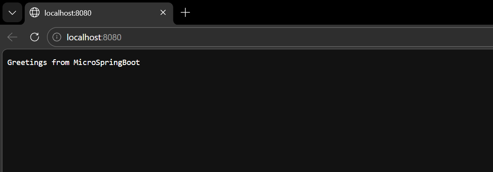

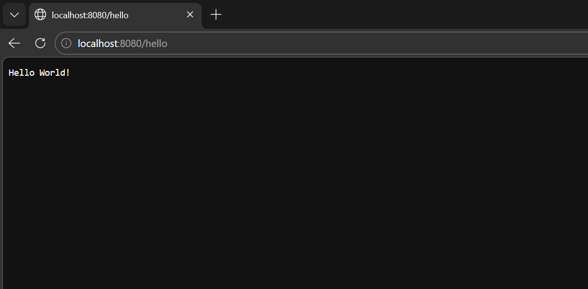

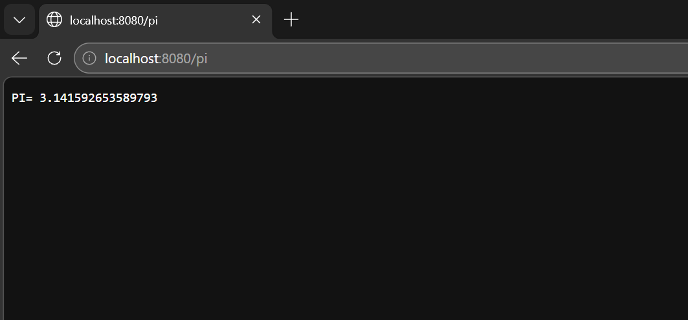

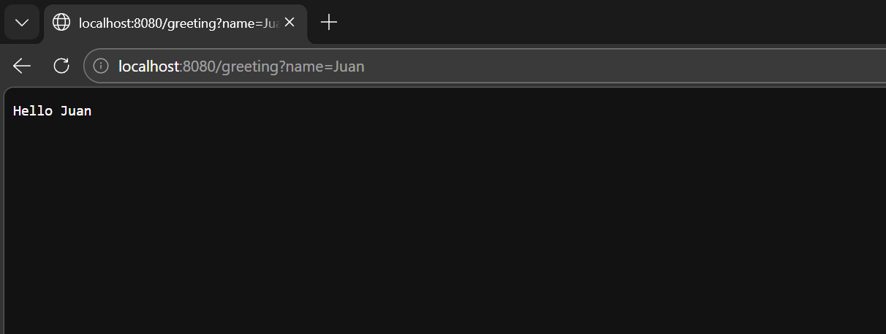


## Annotation Implementation

### @RestController

Marks a class as a REST component that will be discovered by the framework.

```java
@RestController
public class MyController {
    // All methods with @GetMapping will be registered
}
```

Purpose: Identify classes that expose REST services. The framework automatically scans classes with this annotation.

### @GetMapping

Defines a GET HTTP route for a method. The method must return `String`.

```java
@GetMapping("/my-route")
public String myMethod() {
    return "Response";
}
```

Purpose: Map methods to specific HTTP routes. The resulting URL is `http://localhost:8080/my-route`.

### @RequestParam

Extracts input parameters from the query string.

```java
@RequestParam(value = "name", defaultValue = "DefaultValue")
String name
```

Parameters:
- `value`: Name of the parameter in the URL (e.g., `?name=...`)
- `defaultValue`: Default value if the parameter is not provided


## Examples

### Example 1: Create a new controller

Create the file `MyController.java` in `src/main/java/edu/eci/arep/`:

```java
package edu.eci.arep;

@RestController
public class MyController {
    
    @GetMapping("/api/users")
    public String getUsers() {
        return "[{\"id\": 1, \"name\": \"Pedro\"}, {\"id\": 2, \"name\": \"Juan\"}]";
    }
    
    @GetMapping("/api/status")
    public String getStatus(@RequestParam(value = "code", defaultValue = "200") String code) {
        return "Status: " + code;
    }
}
```

Build and run:
```bash
mvn clean compile
java -cp target/classes edu.eci.arep.MicroSpringBoot
```

Test:
- `http://localhost:8080/api/users`
- `http://localhost:8080/api/status`
- `http://localhost:8080/api/status?code=404`

### Example 2: PI Service

```java
@RestController
public class MathController {
    @GetMapping("/pi")
    public String getPi() {
        return "PI = " + Math.PI;
    }
}
```

Access: `http://localhost:8080/pi`

### Example 3: Personalized greeting

```java
@RestController
public class GreetingController {
    @GetMapping("/greet")
    public String greet(@RequestParam(value = "name", defaultValue = "Guest") String name) {
        return "Hello, " + name + "!";
    }
}
```

Access:
- `http://localhost:8080/greet` → "Hello, Guest!"
- `http://localhost:8080/greet?name=Pedro` → "Hello, Pedro!"


## Technical Details

### Architecture

```
HTTP Request
     ↓
WebServer.handleConnection()
     ↓
Route registered?
     ├─ Yes → WebFramework.get() → Controller method
     │         ↓
     │      HttpRequest (extracted parameters)
     │         ↓
     │      invokeMethod() (reflection for parameters)
     │         ↓
     │      String response
     │         ↓
     │      HttpResponse
     ├─ No → Static file (webroot/)
             ↓
          HTTP Response
```

### How it works

1. Scanning: MicroSpringBoot scans the classpath looking for classes annotated with `@RestController`
2. Registration: For each method annotated with `@GetMapping`, it registers the route in WebFramework
3. Server: Starts an HTTP server on port 8080 that handles requests
4. Parameter handling: Automatically extracts query parameters using `@RequestParam`
5. Response: Invokes the corresponding method via reflection and returns the result as text

### Server features

- Port: 8080 (configurable)
- Static files: HTML, CSS, JavaScript, PNG, JPG
- Thread pool: 10 threads to handle concurrent requests
- Route handling: First searches registered routes, then static files


## Testing

Run unit tests:

```bash
mvn test
```

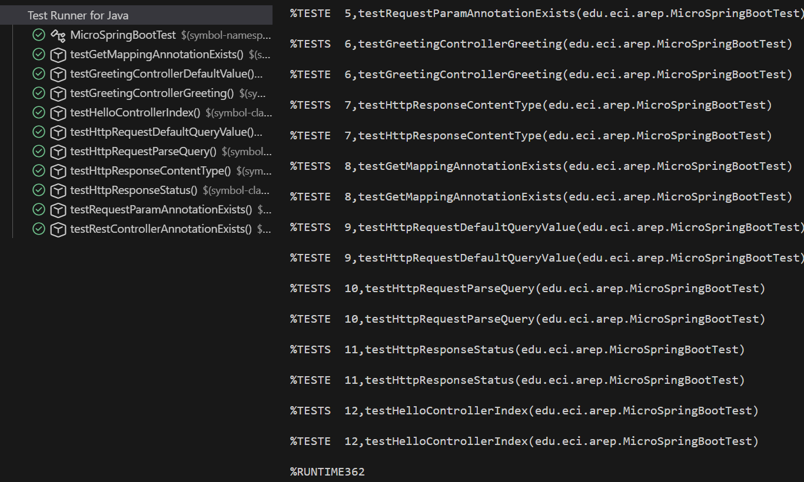

The tests validate:
- ✓ Discovery of @RestController annotations
- ✓ Route mapping with @GetMapping
- ✓ Parameter extraction with @RequestParam
- ✓ Default values for parameters
- ✓ Correct HTTP response
- ✓ Response content and status


## Deployment on AWS

### Prerequisites

1. Active AWS account
2. Access to EC2
3. Java 17 installed locally
4. Git installed

### Step 1: Create EC2 instance

1. Go to AWS Console → EC2
2. Click "Launch Instance"
3. Select:
   - AMI: Amazon Linux 2
   - Instance Type: t2.micro (eligible for free tier)
   - Security Group: Create new with rules:
     - SSH (22) from your IP
     - HTTP (80) from 0.0.0.0/0
     - HTTP (8080) from 0.0.0.0/0

4. Create and download the key pair (.pem)
5. Launch the instance

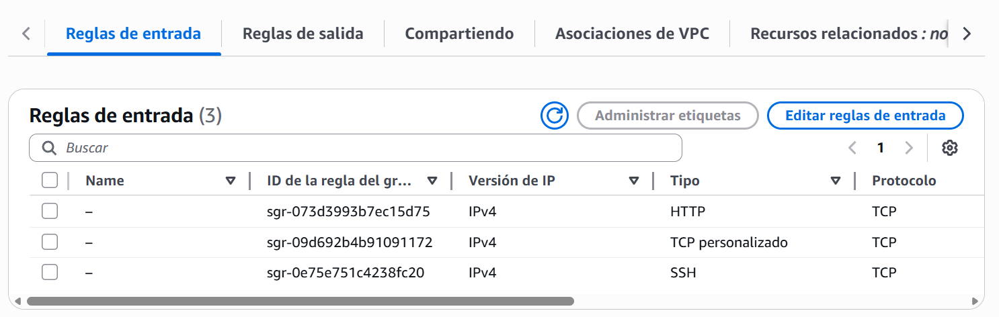

### Step 2: Connect to the instance

```bash
# Make the key executable
chmod 400 your-key.pem

# Connect
ssh -i your-key.pem ec2-user@<instance-public-IP>
```

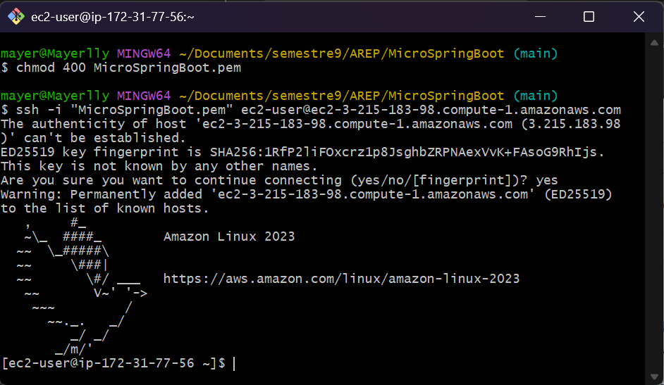

### Step 3: Install requirements on Amazon Linux

```bash
# Update system
sudo yum update -y

# Install Java 17
sudo yum install -y java-17-amazon-corretto

# Install Git
sudo yum install -y git

# Install Maven (optional, if you need to compile on the instance)
sudo yum install -y maven
```

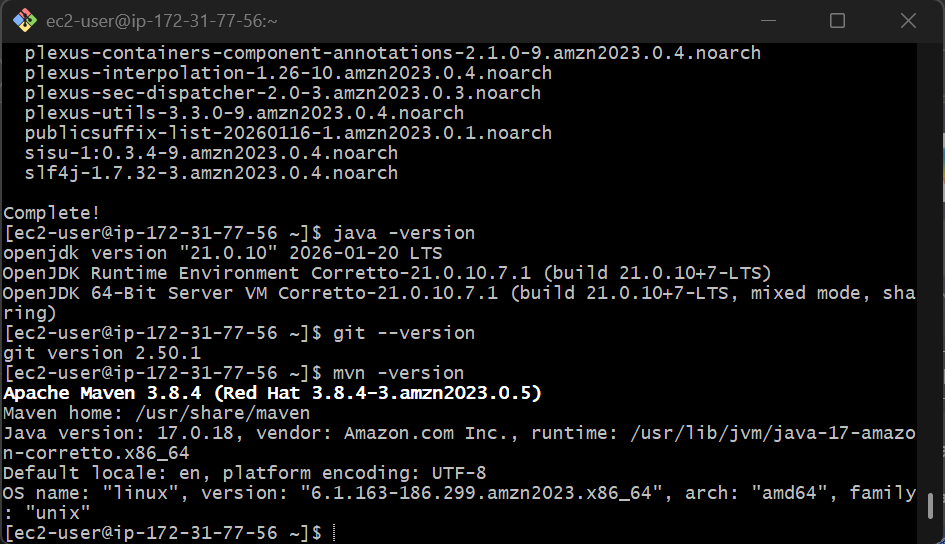

### Step 4: Clone the repository

```bash
# Clone from GitHub
git clone https://github.com/your-username/AREP.git
cd AREP/MicroSpringBoot
```

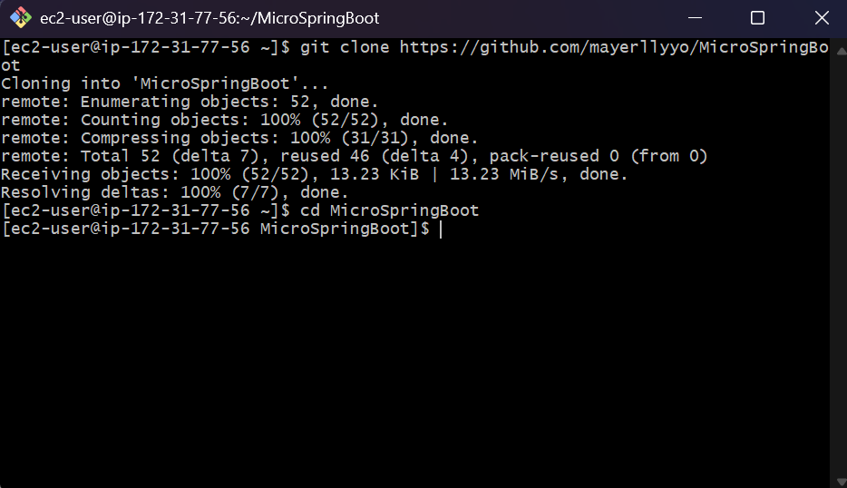

### Step 5: Compile on EC2

```bash
# Build
mvn clean package -DskipTests
```

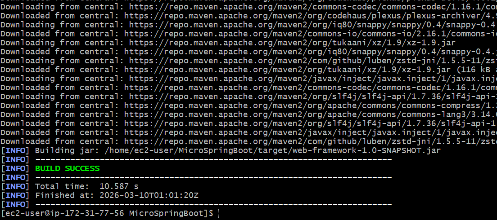

### Step 6: Run compiled JAR

```bash
# Run the JAR in background
java -jar target/web-framework-1.0-SNAPSHOT.jar &
```
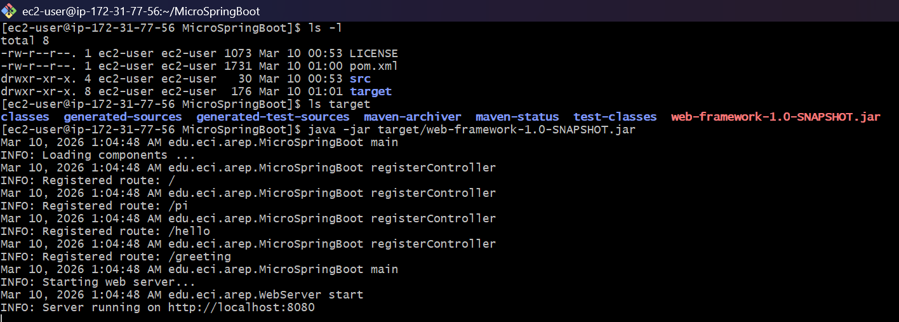
### Step 7: Test the endpoints

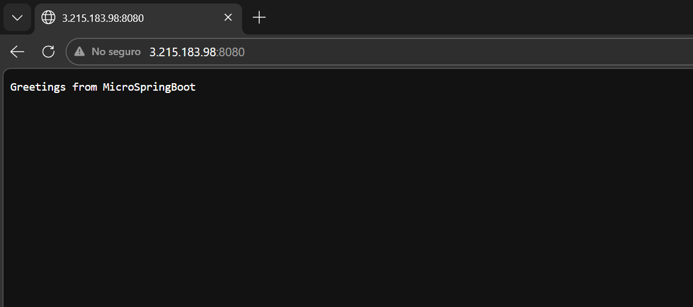

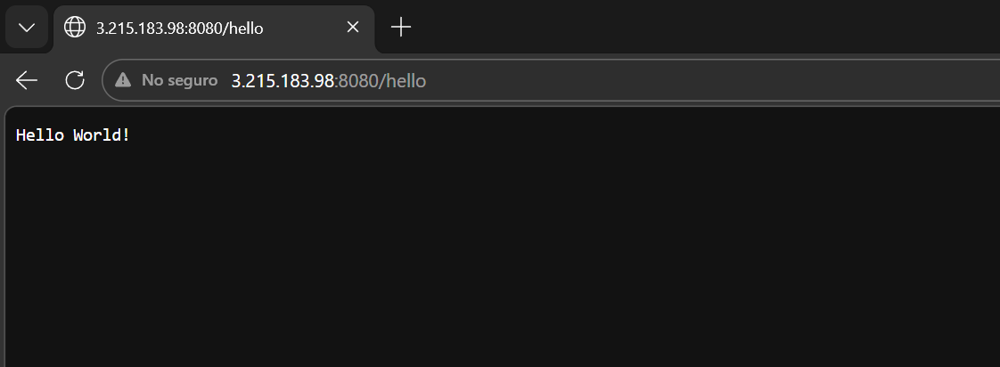

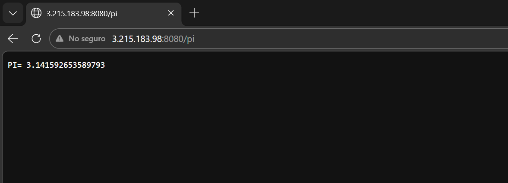

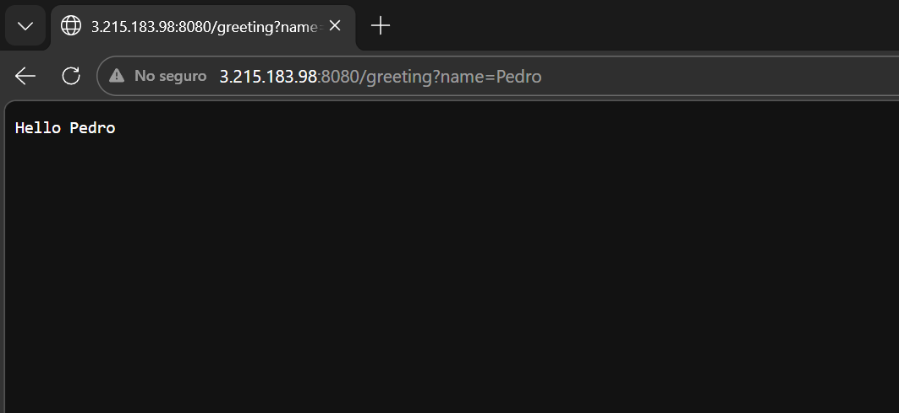

### Access the application

- Locally: `http://localhost:8080`
- On AWS: `http://<public-or-elastic-IP>:8080`


## Technologies

- Language: Java 17
- Build: Maven
- Reflection: Java Reflection API for automatic component discovery
- Concurrent execution: ExecutorService for handling multiple requests
- Cloud: AWS EC2 with Amazon Linux 2

To deploy on AWS:

1. Create an EC2 instance
2. Install Java 17
3. Copy the compiled JAR: `mvn package -DskipTests`
4. Run: `java -jar target/web-framework-1.0-SNAPSHOT.jar`

## Development notes

- The framework uses reflection to discover components at runtime
- Controllers must have parameter-less constructors
- Methods with @GetMapping must return String
- Query parameters are automatically extracted

## Author

- **Mayerlly Suárez Correa** [mayerllyyo](https://github.com/mayerllyyo)

## License

This project is licensed under the MIT License - see the [LICENSE](LICENSE) file for details
